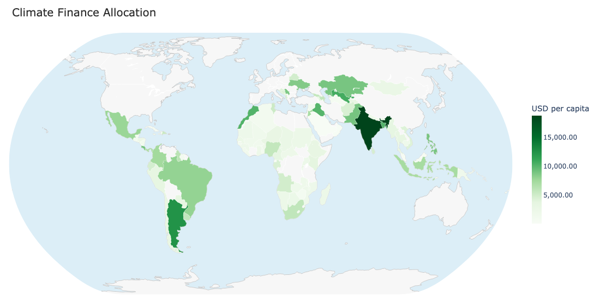
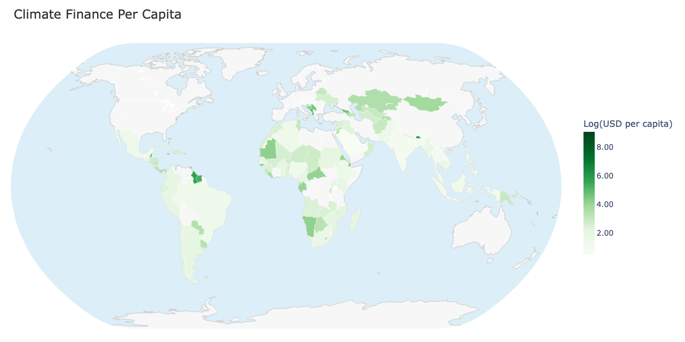
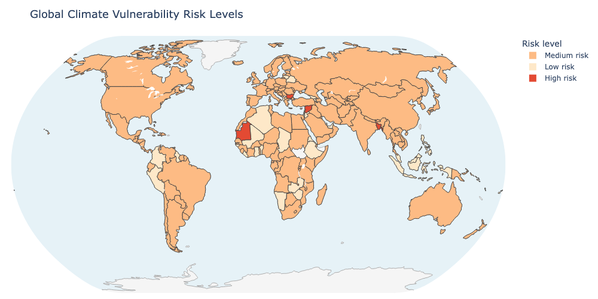
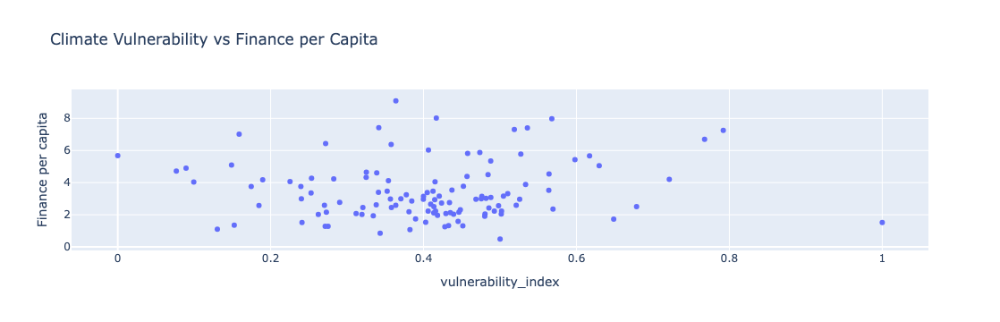
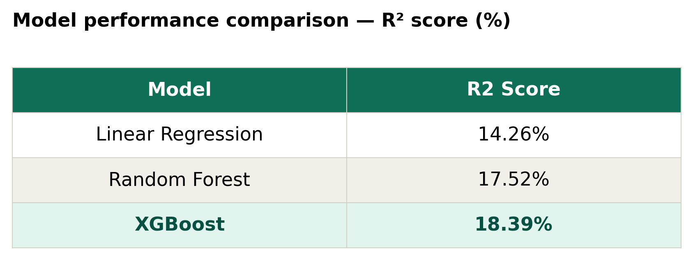
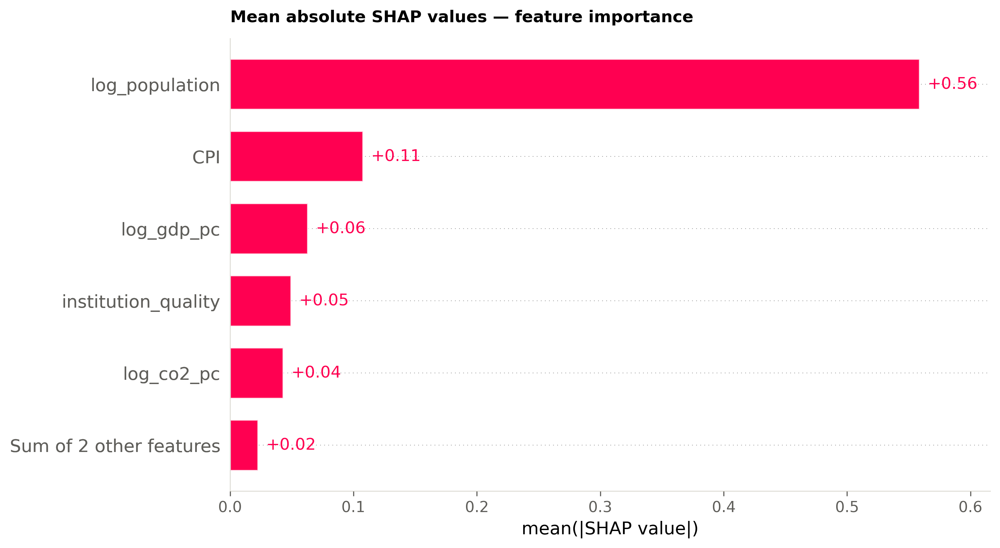
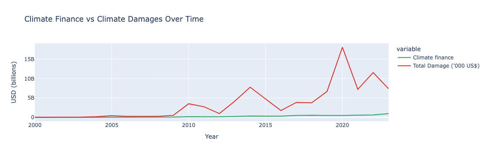

# Decoding Capital Flow in Climate Finance
### A Machine Learning Analysis of Global Climate Finance Per Capita
---

## Table of Contents

1. [Background and Overview](#1-background-and-overview)
2. [Data Structure Overview](#2-data-structure-overview)
3. [Executive Summary](#3-executive-summary)
4. [Insights Deep Dive](#4-insights-deep-dive)
5. [Key Analytical and Engineering Decisions](#5-key-analytical-and-engineering-decisions)
6. [Problems Faced and Solutions](#6-problems-faced-and-solutions)
7. [Recommendations](#7-recommendations)

---

## 1. Background and Overview

### The Problem

Despite global climate finance reaching **$1.2 trillion** in 2023 and repeated pledges from developed nations to direct funds toward the most vulnerable countries, the allocation of climate finance remains deeply disproportionate. Middle-income countries continue to receive greater funding than far more vulnerable regions such as Sub-Saharan Africa and South Asia, regions that bear the heaviest burden of climate-related losses.

Annual climate-related economic losses reached **$2.4 billion**, and an estimated **80% of countries** fall into high or medium physical risk categories. Yet the flow of international finance does not reflect this distribution of need.

### The Research Question

> *Does objective climate vulnerability predict the allocation of international climate finance per capita?*

This project applies supervised machine learning across a panel of **117 countries from 2000 to 2023** to answer this question quantitatively. Rather than relying on descriptive statistics alone, three ML models — Ordinary Linear Regression, Random Forest, and XGBoost, are used to identify what factors actually drive how much climate finance each nation recieves. 

### Key Finding

Machine learning models reveal that **climate vulnerability plays a minimal role (2%)** in explaining finance allocation. Within the 18% of variance the models explain, **population is the dominant predictor**, followed by inflation rate (CPI) and then GPD per capita. Physical climate vulnerability is statistically weak, indicating a systematic misalignment between finance flows and objective climate need. 

---

## 2. Data Structure Overview

The project uses a **panel dataset** constructed by merging four open-access datasets on the shared key of ISO 3166 alpha-3 country codes and year.

### Data Sources

| Dataset | Source | Coverage | Role in Analysis |
|---|---|---|---|
| OECD Climate-Related Development Finance (CRDF) | OECD.stat | 2000–2023 | Target variable — climate finance flows by country-year |
| ND-GAIN Country Index | Notre Dame University | 1995–2022 | Physical risk features — vulnerability and readiness scores |
| World Bank Open Data | data.worldbank.org | 2000–2025 | Macroeconomic controls — GDP, population, CO₂, governance |
| EM-DAT International Disaster Database | CRED, UCLouvain | 2000–2023 | Realised climate losses — disaster economic damages by country-year |

### Panel Dimensions

- **Countries:** 117
- **Years:** 2000–2023
- **Total observations (after cleaning):** ~117 country-year records (panel structured)
- **Merge key:** ISO 3166 alpha-3 country code + year

### Features Used in Modelling

| Feature | Source | Type | Transformation |
|---|---|---|---|
| Physical risk index | ND-GAIN | Continuous (0–1) | None — already bounded |
| Population | World Bank | Continuous | Log-transformed |
| CO₂ per capita | World Bank | Continuous | Log-transformed |
| GDP per capita | World Bank | Continuous | Log-transformed |
| Damages per capita | EM-DAT | Continuous | Log-transformed |
| Inflation (CPI) | World Bank | Continuous | Used as-is |
| Institutional quality | World Bank | Continuous | Averaged from rule of law + control of corruption |

### Target Variable

`log(climate finance per capita)` — climate finance in USD per person, log-transformed to reduce skewness.

---

## 3. Executive Summary

This project investigates whether physical climate vulnerability predicts how much international climate finance a country receives, after controlling for economic, demographic, and governance factors.

**Three supervised ML models** were trained and evaluated using cross-validation:

| Model | R² Score | Interpretation |
|---|---|---|
| Linear Regression (OLS) | 14.26% | Baseline — linear relationships only |
| Random Forest | 17.52% | Captures non-linearity |
| **XGBoost** | **18.39%** | Best performer |

**XGBoost achieves the highest explanatory power**, marginally outperforming Random Forest and the OLS baseline. However, all three models achieve R² below 20%, which is itself a substantive finding: observable country characteristics explain a minority of variance in climate finance allocation.

**SHAP feature importance analysis** reveals:
- **Population** is the dominant predictor of finance received
- **Physical climate vulnerability** accounts for only **2%** of explained variance
- Inflation (CPI) and Gross Domestic Product (GDP) profile are stronger predictors than climate risk

**Conclusion:** Capital follows demographic and economic capacity, and potentially other political and institutional dynamics, not vulnerability. The international climate finance system is not allocating on the basis of measurable climate need.

---

## 4. Insights Deep Dive

### 4.1 Where the Money Goes

Climate finance is geographically concentrated. Raw finance flows show the largest allocations going to **South Asia, Europe, and South America**. However, when adjusted for population — converting to per capita terms — **Africa receives higher relative allocations**, revealing that the metric used to assess equity fundamentally shapes the conclusions drawn.





> **Insight:** Perceived fairness in climate finance depends entirely on the denominator. Absolute flows favour large economies; per capita flows favour smaller ones. Neither fully captures vulnerability-adjusted needs.

### 4.2 Where the Risk Is

The physical risk map tells a sharply different geographic story. **Sub-Saharan Africa, South Asia, and small island developing states** carry the highest composite hazard scores across impact indicators. These regions overlap minimally with the high-finance zones identified above.



> **Insight:** The two maps, finance and risk, show divergent geographies. A viewer can see the mismatch without reading a single data point.

### 4.3 The Mismatch

The scatter plot of physical risk index against log climate finance per capita makes the structural misalignment explicit at country level. Several **low to medium risk countries** — such as Antigua and Barbuda — receive substantially higher mitigation and adaptation finance than **higher-risk countries** including Bangladesh and Mauritania.

Colouring each country by GDP per capita reveals the confounding factor: wealthier countries cluster toward higher finance regardless of their risk level.



> **Insight:** After accounting for GDP, physical risk has almost no independent relationship with how much finance a country receives per person.

### 4.4 The ML Finding — Feature Importance

Within the 18% of variance explained by the models, SHAP analysis ranks the predictors as follows:

1. **Population** — dominant predictor (largest mean absolute SHAP value)
2. **Inflation rate (CPI)** - less positive effect
3. **GDP per capita** — lesser positive effect
4. **Institutional quality** — lesser positive effect
5. **Physical risk index** — minimal role (~2% of explained variance)

The minimal performance gap between the linear OLS model (14.26%) and the best non-linear model XGBoost (18.39%) suggests that while linear trends are present, substantial non-linear relationships and feature interactions exist within the predictable component of the dataset. This implies that physical vulnerability does not primarily shape allocation outcomes. CPI and GDP postiive effect on model output also implies that more stable and wealthier economies recieve far more allocations despite facing significantly lesser climate risk. 





> **Insight:** The system rewards capacity, not need. Countries with larger populations and stronger economies absorb more climate finance, independent of how exposed they are to climate hazards.

### 4.5 Trend and Outlook

The time series from 2000 to 2023 shows climate finance growing slowly and steadily, while climate-related economic damages are volatile and accelerating — with a dramatic spike around 2019–2020 reflecting compounding global climate events. Finance remains severely outpaced by damages throughout the entire period.



> **Insight:** The gap between what climate change costs and what is being spent to address it is structural and widening — not a temporary shortfall.

---

## 5. Key Analytical and Engineering Decisions

### 5.1 Why ND-GAIN Scores Were Averaged Across All Years

Rather than selecting a single year (e.g. 2020), ND-GAIN vulnerability and readiness scores were averaged across all available years for each country. This decision was made because:

- ND-GAIN scores change slowly, they reflect structural country characteristics such as geography, infrastructure, and governance
- Picking one year introduces arbitrary sensitivity to short-term fluctuations
- Averaging produces a more stable, robust measure of underlying risk profile

### 5.2 Why Log Transformation Was Applied

GDP per capita, finance per capita, damages per capita, CO₂ per capita, and population are all heavily right-skewed, a small number of countries have values many times larger than the majority. Log transformation was applied to:

- Compress extreme values and reduce the influence of outliers
- Convert multiplicative relationships to additive ones — a percentage change in GDP is comparable across rich and poor countries; a unit change in raw GDP is not
- Improve model fit for both linear and tree-based models

The physical risk index (bounded 0–1) and institutional quality (symmetric around zero) were not log-transformed as they do not exhibit the same skewness.

### 5.3 Why SHAP Was Used for Feature Importance

SHAP (SHapley Additive exPlanations) was chosen over impurity-based (Gini) importance because:

- Impurity-based importance inflates the apparent importance of continuous, high-cardinality features
- SHAP provides consistent, theoretically grounded attribution based on cooperative game theory
- SHAP values are directional — they show not just which features matter but whether high values push predictions up or down

### 5.4 Why the Target Variable Is Per Capita Not Absolute

Dividing climate finance by population rather than reporting raw dollar totals ensures comparability across countries of very different sizes. A $1 billion flow means very different things for Germany (83 million people) versus Mozambique (33 million people). Per capita normalisation asks the right question: how much climate finance does each person in this country receive?

### 5.5 Composite Index Construction

Two composite features were engineered:

**Physical risk index:** `(vulnerability + (1 − readiness)) / 2`
Higher vulnerability and lower readiness both indicate greater climate risk. Averaging the two produces a single bounded index between 0 and 1.

**Institutional quality:** `(rule_of_law + control_of_corruption) / 2`
Both World Bank governance indicators are on comparable scales ranging from approximately −2.5 to +2.5. Averaging captures the general quality of a country's institutional environment.

---

## 6. Problems Faced and Solutions

### Problem 1 — CPI Data Does Not Provide Country-Level Breakdowns

**Issue:** The Climate Policy Initiative (CPI) Global Landscape of Climate Finance — the most widely cited source — reports finance in regional aggregates rather than by individual country. This made it unsuitable as the primary data source for a country-level analysis.

**Solution:** Switched to the OECD Climate-Related Development Finance (CRDF) dataset, which provides country-year level finance flows. This restricted the sample to OECD-reported flows but enabled the panel structure required for modelling.

### Problem 2 — Substantial Missing Values in EM-DAT Damage Data

**Issue:** Many country-year combinations had no recorded disaster damage — not because damages were zero, but because EM-DAT only records events that cross reporting thresholds. This created ambiguity between true zeros and missing data.

**Solution:** Damages were imputed as zero where no records existed, with this decision explicitly documented as a potential source of model bias. Countries with frequent small-scale losses below the reporting threshold are likely underrepresented.

### Problem 3 — Missing GDP and Population Data

**Issue:** Several country-year observations had gaps in World Bank GDP and population data, particularly for small island states and fragile economies.

**Solution:** Linear interpolation was applied for small gaps within a country's time series. Observations with insufficient data points for reliable interpolation were excluded from the modelling sample.

### Problem 4 — Higher-Income Countries Underreported in Finance Data

**Issue:** Finance allocations for several higher-income countries — including the UK, US, Canada, Australia, and China — are missing or underreported in the OECD CRDF data, likely because these countries are primarily donors rather than recipients.

**Solution:** This was treated as a data limitation and documented explicitly. The analysis focuses on recipient countries, and the absence of major donors from the target variable does not distort the core research question about vulnerability-to-finance alignment.

### Problem 5 — Low R² Across All Models

**Issue:** All three models achieved R² below 20%, which initially appeared to signal model failure.

**Solution:** This was reframed as a substantive analytical finding rather than a technical problem. The low R² indicates that observable country characteristics — including physical risk, GDP, governance, and emissions — explain only a minority of variance in finance allocation. Unobserved political factors, bilateral agreements, and donor institutional preferences may be more dominant drivers. This conclusion is well-supported in the climate finance literature and is itself a meaningful contribution.


---

## 7. Recommendations for Action and Future Work

### 7.1 Adopt Risk-Weighted Allocation Criteria

International climate finance governance frameworks — including the OECD Development Assistance Committee reporting standards and multilateral fund eligibility criteria — should incorporate explicit vulnerability weighting in allocation decisions. Countries above a defined physical risk threshold should receive priority access to adaptation finance, independent of their economic size.

### 7.2 Disaggregate Public from Private Finance

The current analysis combines grants, concessional loans, and private equity into a single target variable. Public finance is theoretically need-driven; private capital is explicitly return-driven. Future allocation assessments and governance frameworks should model these separately, as blending them obscures whether any part of the system is actually responding to vulnerability.

### 7.3 Expand and Standardise Country-Level Reporting

The restriction of this analysis to OECD CRDF data because Global Landscape of Climate Finance (GLCF) data does not provide country-level breakdowns, highlights a critical data gap. A standardised, mandatory country-level climate finance reporting framework would enable more rigorous accountability and research. The UNFCCC Biennial Transparency Reports are a step in this direction but remain inconsistently implemented.

### 7.4 Use Swiss Re Catastrophe Data to Supplement EM-DAT

EM-DAT captures only events above reporting thresholds and has significant missingness for smaller and fragile states. Swiss Re Institute's Natural Catastrophe database provides complementary coverage, particularly for insured losses. Combining both sources would produce more robust damage estimates, especially for small island developing states that are among the most climate-exposed nations in the dataset.

### 7.5 Separately Model Adaptation vs Mitigation Finance

The analysis treats all climate finance as a single pool, but adaptation and mitigation finance follow different allocation logics and serve different purposes. Adaptation finance is explicitly intended to protect vulnerable communities; mitigation finance often follows investment returns. Modelling them separately would reveal whether adaptation at least partially corrects the vulnerability-finance misalignment identified here.

### 7.6 Investigate Political and Institutional Drivers

Given that observable country characteristics explain only 18% of variance in finance allocation, the dominant drivers are almost certainly unobserved — bilateral political relationships, colonial history, trade ties with major donor nations, and participation in specific climate finance frameworks such as the Green Climate Fund. Future work should apply qualitative comparative analysis or network methods to map these political economy factors explicitly.

---

## Project Structure

```
climate-finance-project/
├── data/
│   ├── raw/                  # Downloaded source files (not committed)
│   │   ├── nd_gain.csv
│   │   ├── wb_indicators.csv
│   │   ├── emdat.xlsx
│   │   └── oecd_crdf.csv
│   └── processed/
│       ├── master_panel.csv  # Cleaned merged panel
│       └── model_ready.csv   # Feature-engineered modelling dataset
├── figures/
│   ├── map_finance.png
│   ├── map_risk.png
│   ├── scatter_mismatch.png
│   ├── trend_timeseries.png
│   ├── model_table.png
│   ├── feature_importance.png
│   └── shap_summary.png
├── notebooks/
│   └── climate_finance_analysis.ipynb
├── poster/
│   └── Climate_finance_Poster.pptx
└── README.md
```

---

## Data Sources and References

| Source | Citation |
|---|---|
| OECD Climate-Related Development Finance | OECD – Climate and Development Finance Data, 2023 |
| ND-GAIN Country Index | Notre Dame Global Adaptation Initiative, 2025 |
| World Bank Open Data | World Bank Open Data, 2024 |
| EM-DAT International Disaster Database | CRED, UCLouvain – EM-DAT, 2024 |
| Global Landscape of Climate Finance | Climate Policy Initiative (CPI), 2023 |

All datasets used in this project are freely available and open access. No proprietary data was used.

---

## Technical Requirements

```bash
# Python libraries required
pip install pandas numpy matplotlib seaborn scikit-learn xgboost shap geopandas plotly kaleido openpyxl
```

**Python version:** 3.11+
**Notebook format:** Jupyter (.ipynb)
**Key libraries:** pandas · numpy · scikit-learn · xgboost · shap · plotly · geopandas · matplotlib · seaborn

---


